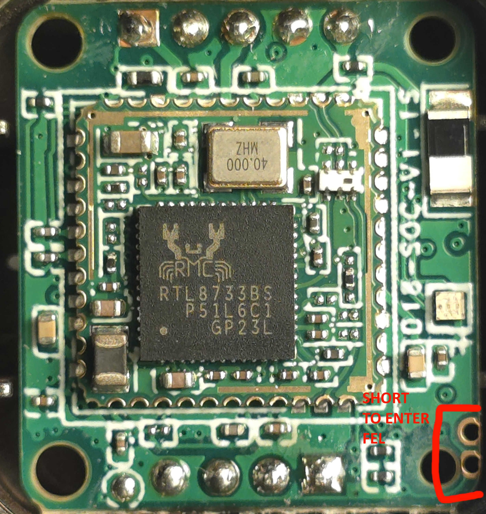

# AA Smartbox Reverse Engineering

This repo contains reverse engineering efforts for wireless Android Auto dongle based on V851S platform.

**Product Link:** [Pionray 2 in 1 Wireless CarPlay Adapter & Android Auto Wireless Adapter](https://www.aliexpress.com/item/1005009708341434.html)

## PCB Images

### Top View (FEL Mode)


## Hardware Info

| Component | Model |
|-----------|-------|
| CPU | V851S |
| Flash | BY25Q128ES (SPI NOR 128MB) |
| WiFi/BT | RTL8733BS |

## Stock Firmware

```bash
Linux CarPlayBox 4.9.191 #1203 PREEMPT Thu Jul 31 03:53:52 UTC 2025 armv7l GNU/Linux

DISTRIB_ID='tina.masnuo.20250728.121733'
DISTRIB_RELEASE='Neptune'
DISTRIB_REVISION='5C1C9C53'
DISTRIB_TARGET='v851s-perf2/generic v2.1'
DISTRIB_DESCRIPTION='tina.masnuo.20250728.121733 4.0.0'
DISTRIB_TAINTS='no-all mklibs busybox'
```

## Getting Access

### Method 1: Using ADB

This device exposes ADB for a few seconds during boot, allowing us to install telnet for persistent access.

**Steps:**

1. Install ADB drivers on your computer
2. Connect device to USB port
3. Wait for the brief moment when ADB is exposed to host
4. Quickly push statically built telnet binary:

```bash
adb push tools/mini_telnetd-static-build/mini_telnetd /bin/
adb shell "chmod +x /bin/mini_telnetd && echo '/bin/mini_telnetd -l /bin/ash&' >> /etc/init.d/rc.final"
```

5. Wait 5 seconds and reconnect dongle to USB to reboot
6. Connect to WiFi created by dongle
7. Connect via telnet:
   ```bash
   telnet 192.168.5.1
   ```
8. Done!

> [!WARNING]
> This exposes a root shell without password. After connecting, edit `/etc/init.d/rc.final` to remove the last line to disable this access.

### Method 2: FEL Mode

V851S supports [FEL mode](https://linux-sunxi.org/FEL) which allows reading/writing flash memory using special tools.

**Entering FEL mode:**
1. Short the exposed vias using tweezers (see PCB image above)
2. Connect device to USB

**Installing tools:**

```bash
apt-get install sunxi-tools
```

**Checking connection:**

```bash
sudo sunxi-fel list
# Expected output:
# USB device 001:003   Allwinner V853    62c05e00:8c404820:01055b28:209a205a
```

**Reading/Writing Flash:**

#### Using xfel (Windows)

Download xfel from the [GitHub Release page](https://github.com/xboot/xfel).

Read full 16MB flash dump (keep this as a backup!):
```bash
.\xfel.exe spinor read 0x00000000 16777216 spiflash_dump.bin
```

Write full flash dump back:
```bash
.\xfel.exe spinor write 0x00000000 spiflash_dump.bin
```

#### Using sunxi-fel (Linux, untested)

```bash
sudo sunxi-fel -p spiflash-read 0 0x8000000 spiflash_dump.bin
``` 

## Modifying the Firmware

You can extract the filesystem from a flash dump, modify it, reconstruct the image using `mount_partitions.sh`, and write it back using FEL mode.

## TODO

- [ ] Extract DTS from stock kernel
- [ ] Build custom kernel
- [ ] Create fully custom image
- [ ] Make BT/WiFi working
- [ ] Run FOSS AA/CarPlay software
